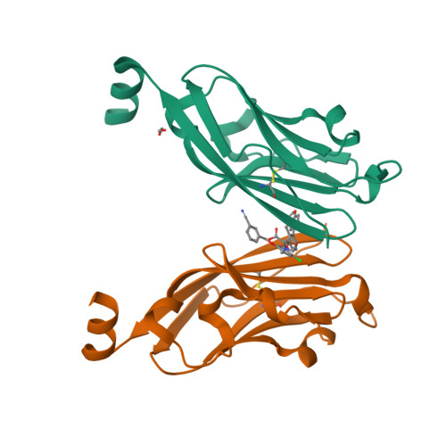

# Virtual screening prototype demonstration

This repository demonstrates a virtual screening of a compound library against the target using various methods. Most of the ideas and codes are adopted from excellent blogs. Please see the references for the sources. 

## Background
- PD-1は抗体（免疫グロブリン）スーパーファミリーの一員であり、
- T細胞（免疫細胞）のProgrammed cell death現象に関わる遺伝子として同定された
- PD-1は、免疫チェックポイントを担う分子であることが明らかになり
- PD-L1（PD-1のリガンド）を発現している細胞は自己として認識され、免疫細胞の攻撃を逃れるように作用する（免疫寛容）
- 一方で、PD-L1を発現する腫瘍細胞（がん細胞）も免疫系の攻撃を逃れてしまう
- そこで考案されたのが、免疫チェックポイント阻害両方であり、PD-1とリガンドの相互作用を阻害してT細胞（免疫細胞、キラーT細胞）が活性化するように促すことで抗腫瘍効果を期待する
- PD-1は細胞表面に存在する受容体タンパク質なので抗体医薬による介入が可能。すでに上市されている。
- しかし、抗体医薬のため、コストや経口投与できないといった難点があり、SMによる代用ができれば実用上のメリットは大きい。

## Target
PD-1/PD-L1 Protein-Protein Interaction

## Library
Compound library by SDF format: [download](https://souyakuchan.s3.amazonaws.com/ddraids/2018/share/library.tar.gz)
- Enamine_Advanced_collection.sdf
- Enamine_HTS_collection.sdf
- Enamine_Premium_collection.sdf
- UOS_HTS.sdf

## Reference
- [Drug discovery battle 2018](https://gist.github.com/souyakuchan/7f9add656d9d6b91f02f6939b88aa2c8) (Japanese only)
- [magattaca's blog](https://magattaca.hatenablog.com/) (Japanese only)

## Steps
TBD: To be done
1. DONE: Read all libraries and Preprocessing
2. TBD: Filtering by Lipnski rule and remove smaller compounds than a threshold.
3. TBD: Filtering by substructure (xxx).
4. TBD: Pharmacophore making and screening
5. TBD: Ligand-based screening using fingerprint and Tamimoto similarity
6. TBD: Structure-based screening using docking score

